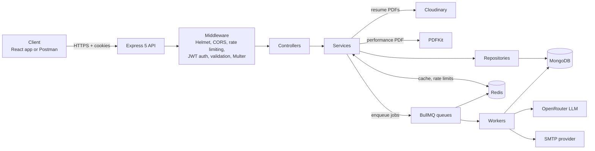
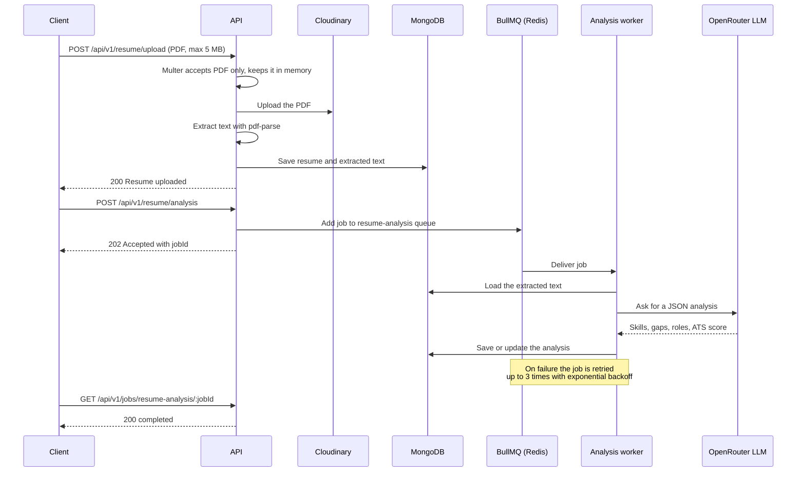
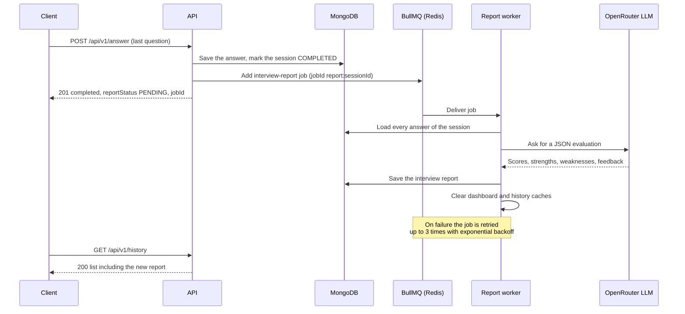
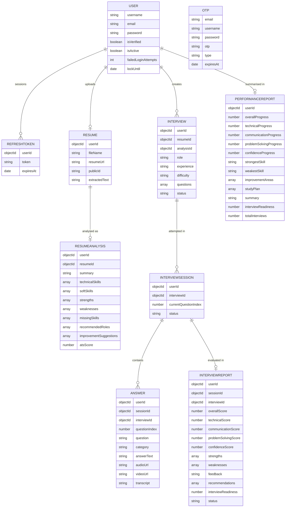
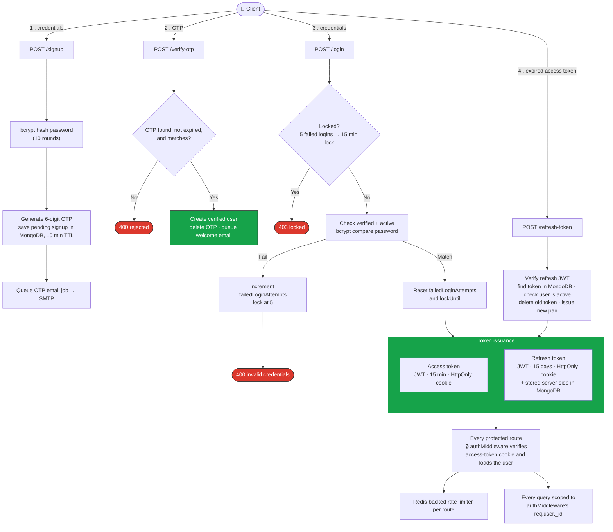
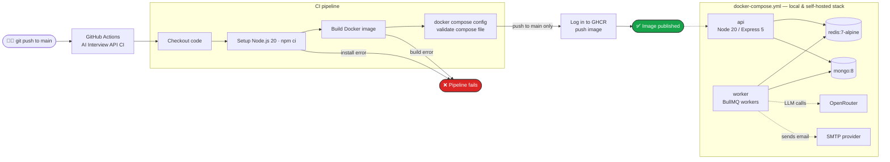

<div align="center">

# 🤖 AI Resume Analyzer & Mock Interview API

**A production-style backend that analyses a candidate's resume with an LLM, runs a question-by-question mock interview, and turns the results into scored reports, a progress dashboard, and a downloadable PDF. Slow AI work runs in background workers powered by BullMQ and Redis.**

<p>
  <a href="https://github.com/nikhilsingh2764/ai-resume-interview-platform/actions/workflows/ci.yml"></a>
  
  
  
  
  
  
</p>

<p>
  <a href="https://YOUR-LIVE-API-URL">Live API</a> ·
  <a href="https://YOUR-FRONTEND-URL">Frontend Demo</a> ·
  <a href="https://YOUR-POSTMAN-COLLECTION-URL">Postman Collection</a>
</p>

</div>

---

## 📖 About

Preparing for interviews usually means guessing what will be asked. This backend removes the guessing: a candidate uploads a resume, the API analyses it, generates interview questions tailored to that resume and a chosen role, and evaluates the answers like a senior interviewer would.

The flow is:

1. **Upload a resume** (PDF). It is stored in Cloudinary and its text is extracted.
2. **Analyse it.** An LLM returns skills, strengths, weaknesses, missing skills, recommended roles, and an ATS score.
3. **Generate a mock interview** for a role, experience level, and difficulty. Questions are based on the resume.
4. **Answer one question at a time.** After the last answer the API produces a scored interview report.
5. **Track progress.** A cumulative performance report, a dashboard, an interview history, and a PDF export.

The main goal was to build it the way a real service is built, not as a simple CRUD demo:

- **Slow AI work never blocks a request.** Resume analysis, interview reports, and performance reports run in BullMQ workers with automatic retries and exponential backoff. The API answers immediately with `202 Accepted` and a `jobId`.
- **Security is layered.** OTP email verification, bcrypt password hashing, short-lived JWT access tokens with rotating refresh tokens in HTTP-only cookies, account lockout, and Redis-backed rate limiting on every sensitive and AI-backed endpoint.
- **It is easy to run and ship.** One `docker compose up` starts the API, the worker, Redis, and MongoDB, and a CI pipeline builds and publishes the image on every push to `main`.

---

## ✨ Features

**Resume management**
- Upload a PDF resume (PDF only, 5 MB max); the file is stored in Cloudinary
- Text is extracted with `pdf-parse` once and stored, so later AI steps never re-read the file
- One resume per user; replace or delete it at any time (Cloudinary file included)

**AI resume analysis**
- Summary, technical skills, soft skills, strengths, weaknesses, and missing skills
- Recommended roles, improvement suggestions, and an ATS score from 0 to 100
- Runs as a background job; one analysis per user, updated on every run

**Mock interviews**
- 10 questions generated from the resume, the analysis, the target role, experience, and difficulty (`Easy`, `Medium`, `Hard`)
- Question categories: Technical, Behavioral, System Design, HR
- Session flow with the server tracking the current question, so a client cannot skip ahead
- One active session per interview

**AI interview reports**
- Overall, technical, communication, problem-solving, and confidence scores
- Strengths, weaknesses, written feedback, recommendations, and an interview-readiness score
- Generated in the background right after the last answer

**Performance tracking**
- Cumulative performance report across all interviews: progress per skill, strongest and weakest skill, improvement areas, and a study plan
- Downloadable performance report as a PDF (PDFKit)
- Dashboard with stats, progress chart, interview history, and the resume analysis in one call
- Paginated, sortable interview history (`latest`, `oldest`, `highest-score`, `lowest-score`)

**Authentication & accounts**
- Email signup with a 6-digit OTP (valid for 10 minutes)
- Login with account lockout after 5 failed attempts
- 15-minute access tokens and 15-day refresh tokens in `HttpOnly` cookies; refresh tokens rotate on every use
- Forgot and reset password by OTP, profile, update username, change password, deactivate and delete account

**Async processing**
- OTP, password-reset, and welcome emails sent by a BullMQ worker
- Resume analysis, interview reports, and performance reports generated by BullMQ workers
- Three attempts per job with exponential backoff
- A job-status endpoint for polling background work

**Operations**
- Docker image and Docker Compose stack (API, worker, Redis, MongoDB)
- GitHub Actions pipeline that builds, validates, and publishes the image
- Redis caching for the dashboard, performance report, and history

---

## 🏗️ Architecture



The code follows a strict layered structure: **routes → controllers → services → repositories → models**. Controllers handle HTTP only, services hold the business logic, and repositories are the only layer that talks to MongoDB.

### Example: uploading and analysing a resume



### Example: finishing an interview



### Background queues

| Queue | Job names | Worker action | Concurrency |
| --- | --- | --- | --- |
| `send-email` | `sendOtp`, `resetPasswordOtp`, `welcomeEmail` | Renders the HTML template and sends the email through SMTP | 5 |
| `resume-analysis` | `analyzeResume` | Sends the resume text to the LLM and saves the analysis | 2 |
| `interview-report` | `generateInterviewReport` | Sends all answers of a session to the LLM and saves the report | 2 |
| `performance-report` | `generatePerformanceReport` | Sends all interview reports to the LLM and saves the performance report | 2 |

All queues use 3 attempts with exponential backoff (5 s base delay) and keep the last 100 completed and failed jobs. AI queues run with low concurrency so the LLM provider is not flooded. The worker runs as its own container in Docker Compose (`node src/worker/index.js`), so background work scales and restarts independently of the API.

**Job status:** async endpoints return `202` with a `jobId`. Clients poll `GET /api/v1/jobs/:queue/:jobId`, which returns the job state (`waiting`, `active`, `completed`, `failed`) and only ever exposes the caller's own jobs.

---

## 🗄️ Data Model

Every business document belongs to a `USER`, and every query is scoped by that user's ID. Interview questions are embedded inside the `INTERVIEW` document.



| Field | Purpose |
| --- | --- |
| `USER.password` | bcrypt hash (10 rounds), excluded from queries by default |
| `USER.failedLoginAttempts`, `lockUntil` | Drive the 5-failures, 15-minute account lockout |
| `OTP` | Holds email-verification and password-reset OTPs; a TTL index on `expiresAt` deletes expired rows automatically. For signups it also holds the username and password hash until the OTP is confirmed |
| `RESUME.userId`, `RESUMEANALYSIS.userId` | Unique, so each user has one resume and one analysis |
| `INTERVIEW.questions` | The generated questions, each with a `question` text and one of four categories |
| `INTERVIEWSESSION.currentQuestionIndex` | Server-side pointer to the next question |
| `ANSWER.audioUrl`, `videoUrl`, `transcript` | Reserved for voice and video answers |

---

## 🗺️ Route Flow (all endpoints)

A single end-to-end journey through every route, in the order a real client calls them — sign up, upload a resume, analyse it, take an interview, and review the results. Every step carries its rate limiter and, where it matters, its BullMQ behavior.

```mermaid
flowchart TD
    Start(["📱 Client"]) --> Signup["POST /signup<br/>signupLimiter"]
    Signup --> SignupSvc["Hash password · save pending signup + 6-digit OTP<br/>in MongoDB, 10 min TTL · enqueue OTP email job"]
    SignupSvc --> OTPSent(["201 OTP sent"])

    OTPSent --> Verify["POST /verify-otp<br/>verifyOtpLimiter"]
    Verify --> VerifyCheck{"OTP found, not expired,<br/>and matches?"}
    VerifyCheck -->|No| VerifyFail(["400 Invalid/expired OTP"])
    VerifyFail --> Verify
    VerifyCheck -->|Yes| VerifySvc["Create verified user · delete OTP<br/>enqueue welcome email job"]
    VerifySvc --> SignupDone(["201 Account created"])

    SignupDone --> Login["POST /login<br/>loginLimiter"]
    Login --> LoginCheck{"Verified, active, not locked,<br/>password correct?"}
    LoginCheck -->|No, 5th fail| Lockout(["403 Account locked 15 min"])
    LoginCheck -->|No| LoginFail(["400 Invalid credentials"])
    LoginFail --> Login
    LoginCheck -->|Yes| Tokens["Issue access token 15m<br/>+ rotating refresh token 15d<br/>→ HttpOnly cookies"]
    Tokens --> LoggedIn(["200 Logged in"])

    LoggedIn --> Account["POST /refresh-token · POST /logout<br/>GET /profile · PATCH /update-profile · PATCH /change-password<br/>PATCH /deactivate-account · DELETE /delete-account<br/>POST /forgot-password · POST /reset-password"]
    LoggedIn --> Jobs["GET /jobs/:queue/:jobId<br/>poll any background job<br/>🔒 authMiddleware"]

    LoggedIn --> Upload["POST /resume/upload<br/>uploadResumeLimiter · 🔒 authMiddleware<br/>Multer: PDF only, max 5 MB"]
    Upload --> UploadSvc["Store PDF in Cloudinary<br/>extract text · save resume"]
    UploadSvc --> Uploaded(["200 Resume uploaded"])
    Uploaded --> ManageResume["GET · PATCH · DELETE /resume<br/>Replace and Delete limiters"]

    Uploaded --> Analyze["POST /resume/analysis<br/>resumeAnalysisLimiter"]
    Analyze --> AnalyzeQ["Enqueue resume-analysis job → 202 + jobId"]
    AnalyzeQ -.-> AnalyzeW["Worker: LLM analysis<br/>ATS score, skills, gaps, roles<br/>3 retries, exponential backoff"]
    AnalyzeW -.-> Analyzed(["Analysis ready"])

    Analyzed --> Generate["POST /generate<br/>interviewQuestionLimiter<br/>role · experience · difficulty"]
    Generate --> GenSvc["LLM writes 10 questions<br/>from resume + analysis"]
    GenSvc --> Created(["201 Interview created"])

    Created --> StartSession["POST /session/start<br/>startInterviewSessionLimiter<br/>one active session per interview"]
    StartSession --> Started(["201 Session started"])
    Started --> Answer["POST /answer<br/>submitAnswerLimiter"]
    Answer --> LastQuestion{"Last question?"}
    LastQuestion -->|No| NextQuestion(["Next question returned"])
    NextQuestion --> Answer
    LastQuestion -->|Yes| ReportQ["Mark session complete<br/>enqueue interview-report job → 201 + jobId"]
    ReportQ -.-> ReportW["Worker: LLM evaluation<br/>scores, feedback, readiness"]
    ReportW -.-> Reported(["Interview report ready"])
    Started -.-> SessionGet["GET /session/:sessionId"]

    Reported --> PerfGen["POST /performance/generate<br/>generatePerformanceReportLimiter"]
    PerfGen --> PerfQ["Enqueue performance-report job → 202 + jobId"]
    PerfQ -.-> PerfW["Worker: LLM summary of all<br/>interview reports"]
    PerfW -.-> PerfReady(["Performance report ready"])

    PerfReady --> Read["GET /performance (cached 5 min)<br/>GET /performance/pdf<br/>🔒 authMiddleware"]
    LoggedIn --> Dashboard["GET /dashboard (cached 5 min)<br/>GET /history (cached 5 min)<br/>🔒 authMiddleware"]

    classDef terminal fill:#000000,stroke:#333,color:#fff
    classDef decision fill:#DC382D,stroke:#333,color:#fff
    class OTPSent,SignupDone,LoggedIn,Uploaded,Analyzed,Created,Started,Reported,PerfReady,Lockout terminal
    class VerifyCheck,LoginCheck,LastQuestion decision
```



**How to read it for an interview walkthrough:**
- Follow the top path for the auth lifecycle: `signup → verify-otp → login → refresh-token`. OTPs expire after 10 minutes, tokens live in HttpOnly cookies, and refresh tokens rotate on every use.
- Follow the middle path for the resume pipeline: `upload → analysis`. Upload is synchronous because it is fast; analysis returns `202` and hands off to a worker.
- Follow the bottom path for the core product loop: `generate → session/start → answer → report → performance`. The last answer never waits for the LLM; it enqueues the report and returns immediately.
- The dotted arrows are background work. The red diamonds are the real conditional logic in the services.
- Every sensitive or AI-backed route carries its own Redis-backed rate limiter, so limits hold even if the API runs as several instances.

---

## 🛠️ Tech Stack

| Category | Technologies |
| --- | --- |
| **Runtime & framework** | Node.js 20, Express 5 (ES modules) |
| **Database** | MongoDB with Mongoose 9 (TTL indexes, populate) |
| **Cache & queues** | Redis (ioredis), BullMQ |
| **AI** | OpenRouter through the OpenAI SDK (free-tier model, JSON-only prompts) |
| **Files & documents** | Multer (memory storage), Cloudinary, pdf-parse, PDFKit |
| **Auth & security** | JWT, bcrypt, Helmet, CORS, express-rate-limit with rate-limit-redis |
| **Validation** | express-validator |
| **Email** | Nodemailer over SMTP |
| **Observability** | Morgan request logging, BullMQ job events |
| **DevOps** | Docker, Docker Compose, GitHub Actions, GitHub Container Registry |
| **Tooling** | Git, Postman, Nodemon |

---

## 📁 Project Structure

```text
.
├── .github/workflows/ci.yml        # CI/CD pipeline
├── Backend/
│   ├── Dockerfile
│   ├── docker-compose.yml          # API + worker + Redis + MongoDB
│   ├── .dockerignore
│   ├── .env.example
│   └── src/
│       ├── server.js               # Startup
│       ├── app.js                  # Middleware and route registration
│       ├── config/                 # db, redis, cloudinary, openrouter
│       ├── route/                  # auth, resume, interview, performance, jobs
│       ├── controller/             # HTTP layer
│       ├── service/                # auth, email, resume, interview, performance
│       ├── repository/             # Database access
│       ├── model/                  # Mongoose schemas
│       ├── validators/             # express-validator rules
│       ├── middleware/             # auth, rate limiters, Multer, validation, errors
│       ├── queues/                 # BullMQ queue definitions
│       ├── worker/                 # BullMQ workers (email, analysis, reports)
│       ├── templates/              # OTP, reset-password, welcome emails
│       └── utils/                  # ai (prompts + client), auth, pdf, upload helpers
└── Frontend/                       # React + Vite client (documented separately)
```

---

## 🔌 API Reference

Base path: `/api/v1`. Route paths are case-insensitive.

<details open>
<summary><b>Authentication</b></summary>

| Method | Endpoint | Auth | Description |
| --- | --- | --- | --- |
| POST | `/signup` | No | Start signup and send an OTP by email |
| POST | `/verify-otp` | No | Verify the OTP and create the account |
| POST | `/login` | No | Log in and set access and refresh cookies |
| POST | `/refresh-token` | Cookie | Rotate the refresh token and issue new tokens |
| POST | `/forgot-password` | No | Send a password-reset OTP |
| POST | `/reset-password` | No | Reset the password with the OTP |
| GET | `/profile` | Yes | Get the current user |
| POST | `/logout` | Yes | Log out and revoke the refresh token |
| PATCH | `/update-profile` | Yes | Update the username |
| PATCH | `/change-password` | Yes | Change password |
| PATCH | `/deactivate-account` | Yes | Deactivate the account |
| DELETE | `/delete-account` | Yes | Delete the account (password required) |

</details>

<details open>
<summary><b>Resume</b></summary>

| Method | Endpoint | Auth | Description |
| --- | --- | --- | --- |
| POST | `/resume/upload` | Yes | Upload a PDF resume (`multipart/form-data`, field `resume`) |
| GET | `/resume` | Yes | Get your resume and extracted text |
| PATCH | `/resume` | Yes | Replace the resume (field `resume`) |
| DELETE | `/resume` | Yes | Delete the resume and its analysis |
| POST | `/resume/analysis` | Yes | Queue an AI analysis, returns `202` with a `jobId` |

</details>

<details open>
<summary><b>Interviews</b></summary>

| Method | Endpoint | Auth | Description |
| --- | --- | --- | --- |
| POST | `/generate` | Yes | Generate 10 questions from `role`, `experience`, `difficulty` |
| POST | `/session/start` | Yes | Start a session for an `interviewId` |
| POST | `/answer` | Yes | Submit `answerText` for the current question of a `sessionId` |
| GET | `/session/:sessionId` | Yes | Get the session and its current question |

</details>

<details open>
<summary><b>Performance, dashboard and jobs</b></summary>

| Method | Endpoint | Auth | Description |
| --- | --- | --- | --- |
| POST | `/performance/generate` | Yes | Queue a cumulative performance report, returns `202` with a `jobId` |
| GET | `/performance` | Yes | Get the performance report (Redis-cached) |
| GET | `/performance/pdf` | Yes | Download the performance report as a PDF |
| GET | `/history` | Yes | Interview history with `page`, `limit`, and `sort` (`latest`, `oldest`, `highest-score`, `lowest-score`) |
| GET | `/dashboard` | Yes | Stats, progress chart, history, and resume analysis in one call (Redis-cached) |
| GET | `/jobs/:queue/:jobId` | Yes | State of one of your background jobs (`resume-analysis`, `interview-report`, `performance-report`) |

</details>

<details>
<summary><b>Example: submitting the last answer</b></summary>

`POST /api/v1/answer`

```json
{
  "sessionId": "665f1c2e8a1b2c3d4e5f6a7b",
  "answerText": "I would use Redis as a cache-aside layer in front of MongoDB..."
}
```

Response for a middle question:

```json
{
  "success": true,
  "message": "Answer submitted successfully",
  "data": {
    "completed": false,
    "answer": { "questionIndex": 3, "category": "Technical" },
    "nextQuestion": { "question": "How does JWT refresh-token rotation work?", "category": "Technical" }
  }
}
```

Response for the last question:

```json
{
  "success": true,
  "message": "Answer submitted successfully",
  "data": {
    "completed": true,
    "reportStatus": "PENDING",
    "jobId": "report:665f1c2e8a1b2c3d4e5f6a7b"
  }
}
```

Poll `GET /api/v1/jobs/interview-report/report:665f1c2e8a1b2c3d4e5f6a7b` until `state` is `completed`, then read the report from `/history` or `/dashboard`.

</details>

---

## 🔐 Security

| Area | Implementation |
| --- | --- |
| **Password storage** | bcrypt hashing with 10 salt rounds; the hash is never returned by default queries |
| **Email verification** | 6-digit OTP with a 10-minute expiry and a TTL index; the user document is created only after the OTP is verified |
| **Sessions** | 15-minute access token and 15-day refresh token in `HttpOnly`, `SameSite=Strict` cookies, `Secure` in production |
| **Refresh tokens** | Stored server-side and rotated on every use, so a used or revoked token stops working |
| **Brute-force protection** | Account locks for 15 minutes after 5 failed logins, plus per-route rate limiting |
| **Rate limiting** | Redis-backed limiters on signup, OTP, login, token refresh, forgot password, and every resume, interview, and AI endpoint, so limits hold across multiple server instances |
| **Upload safety** | PDF-only filter, 5 MB size limit, files handled in memory and never written to disk |
| **Data isolation** | Resumes, analyses, interviews, sessions, and reports are always queried by the authenticated user's ID |
| **HTTP hardening** | Helmet headers, CORS restricted to `CLIENT_URL` with credentials, `trust proxy` for deployment behind a load balancer |
| **Input validation** | express-validator rules on auth and upload routes |
| **Errors** | One central error handler returns clean JSON to clients |
| **Secrets** | All keys come from environment variables; `.env` is git-ignored and `.env.example` documents the names |

### Rate limits

Limiters count requests per client IP and run before authentication.

| Route | Limit | Window |
| --- | --- | --- |
| `POST /signup` | 30 | 1 hour |
| `POST /verify-otp` and `POST /reset-password` | 10 | 15 minutes |
| `POST /login` | 15 | 1 minute |
| `POST /forgot-password` | 3 | 15 minutes |
| `POST /refresh-token` | 30 | 1 minute |
| `GET /profile`, `PATCH /update-profile`, `PATCH /change-password`, `PATCH /deactivate-account`, `DELETE /delete-account` | 200 | 15 minutes |
| `POST /resume/upload` | 10 | 1 hour |
| `PATCH /resume` | 10 | 1 hour |
| `DELETE /resume` | 5 | 1 hour |
| `POST /resume/analysis` | 10 | 10 minutes |
| `POST /generate` | 15 | 1 hour |
| `POST /session/start` | 20 | 1 hour |
| `POST /answer` | 200 | 1 hour |
| `POST /performance/generate` | 23 | 15 minutes |

### Authentication flow

The four steps a client goes through: **signup → verify OTP → login → refresh token**. Every protected route afterwards is checked by `authMiddleware`, and every query is scoped to `req.user._id`.



---

## ⚡ Redis Usage

| Data | Redis key | TTL | Invalidation |
| --- | --- | --- | --- |
| Dashboard | `Dashboard:{userId}` | 5 min | Cleared when an analysis, interview report, or performance report is saved, or the resume is deleted |
| Performance report | `Performance:{userId}` | 5 min | Cleared when a new performance report is saved |
| Interview history | `History:{userId}:{page}:{limit}:{search}:{difficulty}:{category}:{sort}` | 5 min | Cleared when an interview report is saved |
| Rate-limit counters | One prefix per limiter (`login:`, `api:`, `Submit-Answer:`, and so on) | Per limiter window | Expire by window |
| BullMQ jobs | Managed by BullMQ | Last 100 completed and failed jobs kept | Automatic |

---

## 📊 Observability

- **Requests:** Morgan logs every HTTP request.
- **Jobs:** every worker logs completed and failed jobs with the job ID, queue, and attempt number, and failed jobs keep their failure reason for the status endpoint.
- **Errors:** one central error middleware returns a consistent JSON shape (`success`, `statusCode`, `message`, `errors`).
- **Queue state:** completed and failed jobs are kept for inspection (last 100 per queue).

---

## 🚀 Getting Started

### Prerequisites

- Node.js 20 or later
- MongoDB (Atlas or local)
- Redis 7 or later
- A [Cloudinary](https://cloudinary.com/) account for resume storage
- An [OpenRouter](https://openrouter.ai/) API key for the LLM
- An SMTP account for OTP and welcome emails (any provider, or a tool like Mailpit for local testing)

### Run locally

```bash
git clone https://github.com/nikhilsingh2764/ai-resume-interview-platform.git
cd ai-resume-interview-platform/Backend

cp .env.example .env      # then fill in your values
npm install
npm run dev               # API on http://localhost:5000
node src/worker/index.js  # in a second terminal, runs all background workers
```

### Run with Docker

```bash
cd Backend
cp .env.example .env      # required, the compose file reads it
docker compose up --build
```

| Service | Description | Port |
| --- | --- | --- |
| `api` | Express API | http://localhost:5000 |
| `worker` | BullMQ workers for email, analysis, and reports (same image, different command) | — |
| `redis` | Redis 7 (cache, rate limits, queues) | 6379 |
| `mongo` | MongoDB 8 | 27017 |

The compose file overrides `REDIS_URL` and `MONGODB_URI` to point at its own containers, and the API and worker wait for Redis and MongoDB health checks before starting. Cloudinary, OpenRouter, and SMTP stay external.

### Scripts

| Command | What it does |
| --- | --- |
| `npm run dev` | Start the API with Nodemon |
| `npm start` | Start the API (production) |
| `node src/worker/index.js` | Start all BullMQ workers |

### Environment variables

| Variable | Description |
| --- | --- |
| `NODE_ENV` | `development` or `production` (controls the `Secure` cookie flag) |
| `PORT` | Server port (default `5000`) |
| `CLIENT_URL` | Frontend origin allowed by CORS |
| `MONGODB_URI` | MongoDB connection string |
| `REDIS_URL` | Redis connection string |
| `ACCESS_TOKEN_SECRET` | Secret for signing access tokens |
| `ACCESS_TOKEN_EXPIRES_IN` | Access token lifetime, for example `15m` |
| `REFRESH_TOKEN_SECRET` | Secret for signing refresh tokens |
| `REFRESH_TOKEN_EXPIRES_IN` | Refresh token lifetime, for example `15d` |
| `EMAIL_HOST` | SMTP server host |
| `EMAIL_PORT` | SMTP server port |
| `EMAIL_USER` | SMTP username and sender address |
| `EMAIL_PASS` | SMTP password |
| `CLOUDINARY_CLOUD_NAME` | Cloudinary cloud name |
| `CLOUDINARY_API_KEY` | Cloudinary API key |
| `CLOUDINARY_API_SECRET` | Cloudinary API secret |
| `OPENROUTER_API_KEY` | OpenRouter API key |

Use long, random values for the token secrets and never commit your `.env` file.

---

## 🔄 CI/CD

Every push and pull request to `main` runs the pipeline in [`.github/workflows/ci.yml`](.github/workflows/ci.yml). A push to `main` also publishes the Docker image to GitHub Container Registry. The right-hand side of the diagram shows the Docker Compose stack used for local and self-hosted runs.



The pipeline fails if dependencies do not install, the image does not build, or the compose file is invalid.

---

## 🧠 Design Decisions

- **Queue the LLM, not the login:** an LLM call takes seconds and can fail or be rate-limited, especially on a free-tier model. Moving analysis and report generation to BullMQ keeps API latency low and gives retries and backoff for free.
- **Questions stay synchronous:** the candidate cannot start an interview without questions, so `POST /generate` waits for the LLM. Everything the user does not need to wait for, such as reports, is queued.
- **Idempotent report jobs:** an interview report job uses a deterministic ID (`report:{sessionId}`), so a double-submitted last answer can never produce two reports.
- **Extract text once:** the PDF text is stored on the resume when it is uploaded, so analysis and question generation never download or parse the file again.
- **Server-owned interview state:** the session stores `currentQuestionIndex`, and the API always answers the current question, so a client cannot skip or reorder questions.
- **JSON-only prompts:** every prompt asks the model for strict JSON. Output that does not parse fails the job, and BullMQ retries it.
- **One resume, one analysis per user:** unique indexes enforce it, and analysis is an upsert, so the dashboard always shows a single current result.
- **OTPs in MongoDB with a TTL index:** expired OTPs delete themselves, and a pending signup never creates a user document until the code is confirmed.
- **Lockout on top of rate limiting:** rate limiting slows bursts from one IP, while the account lockout protects a single account from slow guessing.
- **Rotating refresh tokens:** every refresh issues a new token and deletes the old one, so a stolen token that was already used stops working.
- **Cache what is read often and changes rarely:** the dashboard, history, and performance report are cached for 5 minutes and invalidated as soon as the underlying data changes.
- **Separate worker container:** the same image runs the API and the workers with different commands, so background work can be scaled or restarted without touching the API.
- **Repository layer:** database access lives in one place, which keeps services testable and makes the user-scoping rule easy to enforce.

---

## 🗺️ Roadmap

- [ ] Voice and video answers using the reserved `audioUrl`, `videoUrl`, and `transcript` fields
- [ ] Schema validation (Zod) for AI responses and interview request bodies
- [ ] Configurable LLM model and provider fallback
- [ ] Health, liveness, and readiness endpoints for Docker and uptime monitors
- [ ] Structured logging (Pino) and Sentry error tracking
- [ ] Automated tests (Jest and Supertest) and a lint step in the CI pipeline
- [ ] Bull Board dashboard for monitoring queues and failed jobs
- [ ] Swagger UI (OpenAPI) documentation

---

## 👨‍💻 Author

**Nikhil Singh**, Backend Engineer

[](https://www.linkedin.com/in/nikhil-singh-802594231/)
[](mailto:nikhilsingh2764@gmail.com)
[](https://github.com/nikhilsingh2764)

If you found this project useful, consider giving it a ⭐
